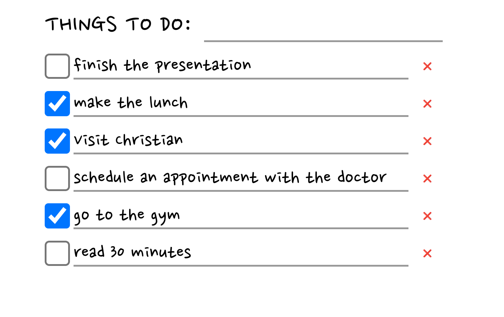

# Simple Todo! 📝
## Table of Contents
1. [General Info](#general-info)
2. [Technologies](#technologies)
3. [Installation](#installation)
### General Info
***
Simple Todo is a web application where you can manage your time by creating todos ⚡.
### Screenshot

## Technologies
***
List of technologies used within the project:
* [Go (programming language)](https://go.dev/): Version 1.21.5
* [Echo (web framework)](https://echo.labstack.com/): Version 4.11.4
* [SQLite (database)](https://www.sqlite.org/index.html): Version 1.5.4 (driver)
* [Gorm (ORM)](https://gorm.io/index.html): Version 1.25.5
* [Templ (templating language)](https://gorm.io/index.html): Version 0.2.501
* [HTMX (html tool)](https://htmx.org/): Version 1.9.10
## Installation
1. Clone this repository
2. Install go https://go.dev/dl/
3. Run application
```
go run main.go
```